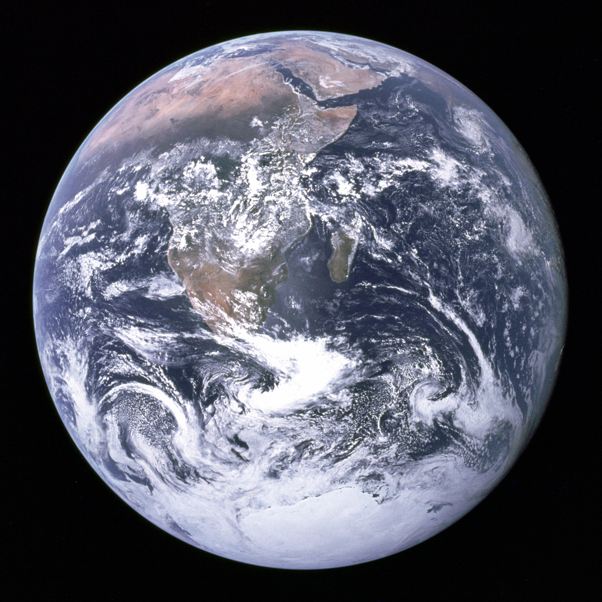

theme: Simple, 1
background-color: #0B0E0E
slidenumbers: false
header: GillSans-Bold, alignment(center), #F1F2F2
header-strong: GillSans-Bold, #1DCE6C
header-emphasis: GillSans-Bold, #EA4B35
text: GillSans, line-height(0.5), #F1F2F2
text-strong: GillSans-SemiBold, #1DCE6C
text-emphasis: GillSans-SemiBoldItalic, #EA4B35
footer: \#hashtag **|** My Cool Footer **|** @twitter **|** no-reply@mail.me
footer-style: Gill Sans Light, alignment(center), #F1F2F2

[.hide-footer]
[.header: text-scale(2.0)]
# Title
## Subtitle

---

# Introduction

Welcome this is a **test** test abc *test*

* line 1
* line 2
* line 2
* line 2
* line 2
* line 2

---

# Code

```bash
$ echo "Hello World"
```

---



---

[.header: text-scale(2.0)]
# Q & A

---

[.header: text-scale(2.0)]
# Thank you**!**

