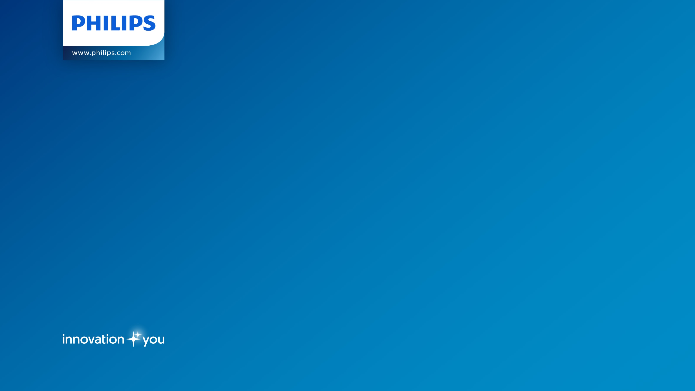
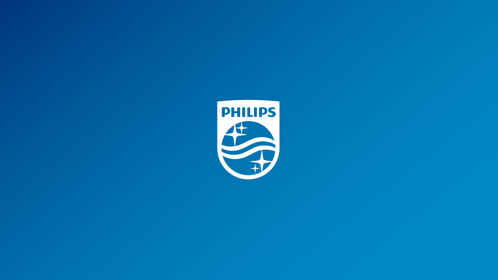

theme: Simple, 1
background-color: #FFFFFF
code: Fira Code Medium, #EE783F, #8B3D90, #2E59A2, #DF393F, #1EA8D9
header: Open Sans, alignment(left), #000000
header-strong: Open Sans Bold, #0067D2
text: Open Sans, line-height(0.5), #000000
text-strong: Open Sans Bold, #0067D2
footer: © Philips Research 2018
footer-style: Open Sans Light, alignment(center), #000000
slidenumbers: false

[.header: #FFFFFF]
[.hide-footer]

# Title
## Subtitle

---


# Introduction

Welcome

---


# Summary

* line 1
* line 2

---


# Code

```bash
$ echo "Hello World"
```

---

[.header: alignment(center), text-scale(2.0)]

# Q & A

---

[.header: alignment(center), text-scale(2.0)]

# Thank you**!**

---

[.hide-footer]

